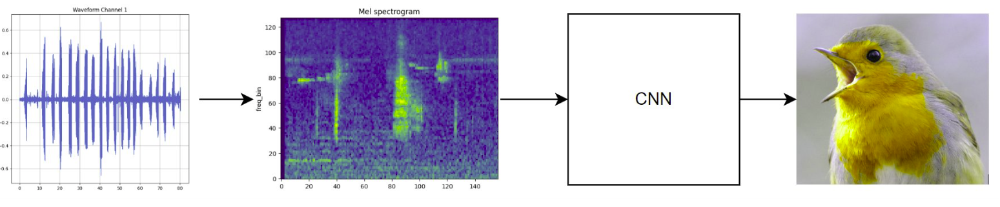
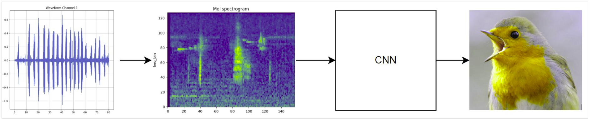

# Birdclef 2023
The goal was to  identify which birds are calling in long recordings made in Kenya. This project idea is taken from Kaggle's Birdclef 2023 Challenge.
To develop this project we used a pipeline built on top of torchaudio and librosa​, using Weight & Biases to track the experiments.

## The Data
The dataset comprises 16,000 distinct audio samples of varying lengths. Here are the key features included in the dataset:
1. Species: This serves as the primary label.
2. Type: Manually annotated tags such as “call,” “song,” “flight call,” and “adult.”
3. Latitude and Longitude Information: Provides positional data.
4. Rating: Manually assigned quality ratings.
We have decided to remove all audio samples with a rating lower than 3​ as they accounted for only 14% of the data​. Moreover we immediatly noticed a problem of class unbalance which has to be dealt with. 

## Our pipeline
The typical pipeline consists of converting an audio waveform into a Mel Spectrogram, followed by using a Convolutional Neural Network (CNN) for classification. The Mel Spectrogram’s representation plays a crucial role in shifting an audio classification problem into an image classification task based on the generated spectrogram.

To improve the results we decided to employ an adaptive procedure named perchannel energy normalization [PCEN](https://www.justinsalamon.com/uploads/4/3/9/4/4394963/lostanlen_pcen_spl2018.pdf) which allows to better separate bird calls from the background noise. 

## Dealing With Unbalance
We decided to perform oversampling in order to deal with class unbalance, the number of samples is based on the class count while the audio to be oversampled is choosen based on its relative length on the total length of that class audio. The following graph shows the resulting per-class F1 score with the relative class prevalence.

