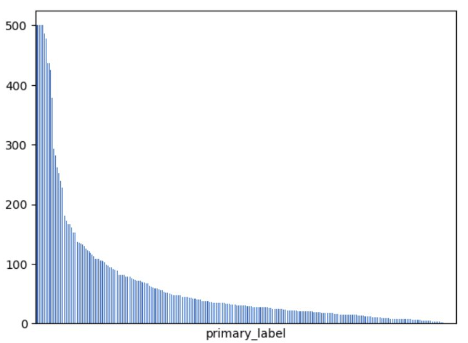

# Birdclef 2023
The goal was to  identify which birds are calling in long recordings made in Kenya. This project idea is taken from Kaggle's Birdclef 2023 Challenge.

To develop this project we used a pipeline built on top of torchaudio and librosa​, using Weight & Biases to track the experiments.

## Our pipeline
The typical pipeline consists of converting an audio waveform into a Mel Spectrogram, followed by using a Convolutional Neural Network (CNN) for classification. The Mel Spectrogram’s representation plays a crucial role in shifting an audio classification problem into an image classification task based on the generated spectrogram.

